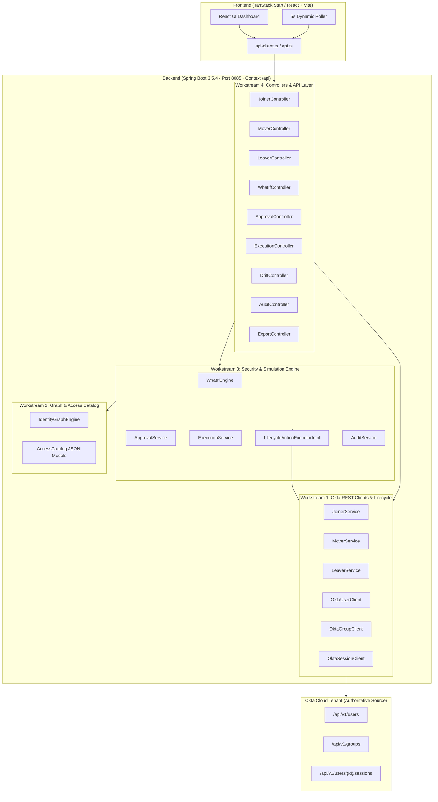

# 📘 Comprehensive Study Guide: Okta Identity Lifecycle Orchestrator

An end-to-end technical guide explaining architecture, class hierarchies, core functions, Okta REST API integration, security mechanics, and presentation walkthroughs.

---

## Table of Contents
1. [Executive Summary & Problem Statement](#1-executive-summary--problem-statement)
2. [High-Level Architecture & Data Flow](#2-high-level-architecture--data-flow)
3. [Deep-Dive: Workstream Breakdown](#3-deep-dive-workstream-breakdown)
   - [Workstream 1: Okta Lifecycle & Client Engine](#workstream-1-okta-lifecycle--client-engine)
   - [Workstream 2: Identity Graph & Access Impact Engine](#workstream-2-identity-graph--access-impact-engine)
   - [Workstream 3: Simulation, Security, & Governance Gate](#workstream-3-simulation-security--governance-gate)
   - [Workstream 4: Dashboard Integration & Reconciliation](#workstream-4-dashboard-integration--reconciliation)
4. [Live Okta API Integration Technicalities](#4-live-okta-api-integration-technicalities)
5. [Frontend Architecture & Reactive Polling](#5-frontend-architecture--reactive-polling)
6. [API Reference & Endpoint Map](#6-api-reference--endpoint-map)
7. [Judge Presentation & Live Demo Script](#7-judge-presentation--live-demo-script)

---

## 1. Executive Summary & Problem Statement

### 🎯 The Problem
Modern enterprises handle hundreds of joiners, movers, and leavers daily. In traditional setups:
1. **Accidental Blast Radius**: Moving or offboarding an employee might unintentionally revoke access to mission-critical infrastructure or cause permission drift.
2. **Lack of Impact Previews**: Admins perform destructive changes directly in Okta with zero prior knowledge of blast radius.
3. **No Approval Gating for Mutations**: Direct modifications bypass IT/Security reviews.
4. **Out-of-Band Permission Drift**: Changes made directly in the Okta console cause compliance violations against authoritative HR baselines.

### 💡 The Solution
The **Okta Identity Lifecycle Orchestrator** is an enterprise-grade Identity Governance and Administration (IGA) platform that interfaces directly with live Okta tenants. It enforces a strict **`Simulation ≠ Execution`** security contract:
* **Simulate**: Predict access deltas, blast radius, and risk scores before anything changes.
* **Approve**: Route high-risk actions to an approval workflow.
* **Execute**: Commit approved mutations directly to Okta via REST APIs.
* **Reconcile**: Continuously monitor and remediate unauthorized drift.

---

## 2. High-Level Architecture & Data Flow



---

## 3. Deep-Dive: Workstream Breakdown

### Workstream 1: Okta Lifecycle & Client Engine
Located in: `backend/src/main/java/com/company/identity/workstream1_okta_lifecycle/`

#### 1. `OktaUserClient.java`
* **Purpose**: Low-level REST client communicating with Okta `/api/v1/users`.
* **Key Methods**:
  * `getUsers()`: Queries `GET /api/v1/users?limit=50`. Parses Okta profile schema fields (`firstName`, `lastName`, `email`, `login`, `department`, `title`, `employeeNumber`). Computes risk score dynamically.
  * `createUser(User user)`: Sends `POST /api/v1/users?activate=false`. Passes standard Okta schema (`profile.title` and `profile.employeeNumber`).
  * `activateUser(String userId)`: Sends `POST /api/v1/users/{userId}/lifecycle/activate?sendEmail=false`.
  * `suspendUser(String userId)`: Sends `POST /api/v1/users/{userId}/lifecycle/suspend`.
  * `unsuspendUser(String userId)`: Sends `POST /api/v1/users/{userId}/lifecycle/unsuspend`.
  * `deactivateUser(String userId)`: Sends `POST /api/v1/users/{userId}/lifecycle/deactivate`.
* **Okta Schema Constraint Handling**: Built-in fallback ensuring custom attributes that are not in default Okta schemas do not trigger 400 Bad Request errors.

#### 2. `OktaGroupClient.java`
* **Purpose**: Manages Okta group memberships (`/api/v1/groups`).
* **Key Methods**:
  * `getGroups()`: Fetches all Okta tenant groups.
  * `getGroupMembers(String groupId)`: Fetches users belonging to a group.
  * `getUserGroups(String userId)`: Fetches groups for a given user (`GET /api/v1/users/{userId}/groups`).
  * `addUserToGroup(String groupId, String userId)`: Sends `PUT /api/v1/groups/{groupId}/users/{userId}`.
  * `removeUserFromGroup(String groupId, String userId)`: Sends `DELETE /api/v1/groups/{groupId}/users/{userId}`.

#### 3. `OktaSessionClient.java`
* **Purpose**: Session revocation for zero-trust offboarding.
* **Key Methods**:
  * `revokeSessions(String userId)`: Sends `DELETE /api/v1/users/{userId}/sessions`. Instantly revokes all active Okta SSO sessions and federated IdP tokens.

#### 4. Lifecycle Services (`JoinerService`, `MoverService`, `LeaverService`)
* `JoinerService.joiner(JoinerRequest)`: Creates user in Okta $\rightarrow$ Activates user $\rightarrow$ Assigns department birthright groups. Fault-tolerant (wrapped in try-catches so missing tenant group policies do not abort user creation).
* `MoverService.mover(userId, MoverRequest)`: Updates profile in Okta (`department`, `title`) $\rightarrow$ Reconciles old vs new group memberships.
* `LeaverService.leaver(userId, LeaverRequest)`: Revokes active sessions $\rightarrow$ Removes user from all groups $\rightarrow$ Deactivates Okta identity.

---

### Workstream 2: Identity Graph & Access Impact Engine
Located in: `backend/src/main/java/com/company/identity/workstream2_identity_graph/`

#### 1. `IdentityGraphEngine.java`
* **Purpose**: Builds an in-memory graph representation of identities, entitlements, departments, and applications.
* **Access Matrix / Catalog**:
  * Maps departments (`Engineering`, `Security`, `Finance`, `Sales`, `HR`) to birthright access lists and privileged tiers.
  * Calculates cross-functional access relationships.

#### 2. Access Impact & Delta Computation
* Computes `AccessDelta` (`granted`, `revoked`, `unchanged`).
* Detects **Segregation of Duties (SoD)** violations: For example, an identity having both `Finance-Billing` and `Engineering-Prod-DB-RW`.

---

### Workstream 3: Simulation, Security, & Governance Gate
Located in: `backend/src/main/java/com/company/identity/workstream3_simulation_security/`

#### 1. `WhatIfEngine.java`
* **Purpose**: Evaluates hypothetical changes without mutating Okta.
* **Key Method**: `simulate(WhatIfRequest)`
  * Computes blast radius (number of affected applications and groups).
  * Calculates a risk score ($0-100$) based on privilege levels and SoD conflicts.
  * Determines if `requiresApproval` is `true` (triggered if risk score $\ge 60$ or action is destructive).

#### 2. `ApprovalService.java`
* **Purpose**: State machine managing simulation approval lifecycles.
* **States**: `PENDING` $\rightarrow$ `APPROVED` | `REJECTED`.
* **Methods**:
  * `registerSimulation(WhatIfResult)`: Automatically stores new simulations in `PENDING` state.
  * `approve(simulationId)`: Sets status to `APPROVED`.
  * `reject(simulationId)`: Sets status to `REJECTED`.
  * `isApproved(simulationId)`: Security barrier checked before execution.

#### 3. `ExecutionService.java` & `LifecycleActionExecutorImpl.java`
* **Purpose**: Executes approved mutations against Okta.
* **Security Check**:
  ```java
  if (!approvalService.isApproved(simulationId)) {
      throw new IllegalStateException("Simulation " + simulationId + " has NOT been approved.");
  }
  ```
* **Execution**: Dispatches the action (`ACTIVATE`, `SUSPEND`, `UNSUSPEND`, `DEACTIVATE`) to `OktaUserClient` and `OktaSessionClient`.

---

### Workstream 4: Dashboard Integration & Reconciliation
Located in: `backend/src/main/java/com/company/identity/workstream4_dashboard_integration/`

#### 1. `AuditService.java`
* **Purpose**: In-memory compliance audit log recording every mutation, approval, and drift remediation.
* **Event Structure**: `id`, `at` (ISO timestamp), `actor`, `action`, `target`, `result`, `risk`, `detail`.

#### 2. `ReconciliationService.java`
* **Purpose**: Scans Okta directory against baseline policies to find out-of-band drift.
* **Remediation**: `remediate(driftId)` updates drift state to `REMEDIATED` and logs an audit trail.

#### 3. `ExportController.java`
* **Purpose**: Streams a live, RFC-4180 compliant CSV export of all Okta identities (`GET /api/users/export`).

---

## 4. Live Okta API Integration Technicalities

### Headers & Authentication
Every request to Okta includes:
```http
Authorization: SSWS <OKTA_API_TOKEN>
Accept: application/json
Content-Type: application/json
```

### Profile Field Mapping
| Java Model Field | Okta Schema Key | Description |
| :--- | :--- | :--- |
| `name` | `firstName`, `lastName` | Split into first/last name |
| `email` / `login` | `email`, `login` | Standard username & communication email |
| `department` | `department` | Authoritative organizational unit |
| `role` / `title` | `title` | Okta standard job title |
| `employeeId` | `employeeNumber` | Okta standard employee identifier |

---

## 5. Frontend Architecture & Reactive Polling

### 1. Technology Stack
* **Framework**: React 19 + TypeScript + TanStack Router
* **Styling**: Tailwind CSS + custom dark/light theme tokens
* **Animations**: GSAP + Tailwind CSS keyframe micro-animations
* **Icons**: Lucide React

### 2. Live Synchronization
* `frontend/src/routes/users.tsx` uses a **5-second polling interval** in `useEffect` so changes made in Okta or other browser tabs automatically reflect without requiring a hard refresh.
* Configured with `VITE_API_BASE_URL=http://localhost:8085/api` for environment-driven backend resolution.

### 3. Interactive Entitlements Tailoring
* **Joiner Wizard**: Granular removal (`×`) and dynamic addition (`+ Add Group`, `+ Add App`) of birthright entitlements before creating the user.
* **Mover Wizard**: Granular customization of `customGranted` and `customRevoked` group lists.
* **Leaver Wizard**: Multi-point safety checklist with real-time active entitlement preview.

---

## 6. API Reference & Endpoint Map

| Method | Path | Controller | Purpose |
| :--- | :--- | :--- | :--- |
| `GET` | `/api/users` | `UserController` | List all live Okta users with calculated risk |
| `GET` | `/api/users/{id}` | `UserController` | Get single Okta user profile |
| `GET` | `/api/users/{id}/groups` | `UserController` | Get groups assigned to user |
| `GET` | `/api/users/export` | `ExportController` | Download live RFC-compliant CSV |
| `POST` | `/api/lifecycle/joiner` | `JoinerController` | Onboard candidate into Okta |
| `PUT` | `/api/lifecycle/mover/{id}` | `MoverController` | Transfer identity & update Okta |
| `POST` | `/api/lifecycle/leaver/{id}` | `LeaverController` | Revoke sessions & deactivate user |
| `POST` | `/api/what-if` | `WhatIfController` | Compute blast radius & register simulation |
| `POST` | `/api/approval/{id}/approve` | `ApprovalController` | Approve simulation |
| `POST` | `/api/approval/{id}/reject` | `ApprovalController` | Reject simulation |
| `POST` | `/api/execution/{id}` | `ExecutionController` | Execute approved action in Okta |
| `GET` | `/api/drift` | `DriftController` | List detected out-of-band drift |
| `POST` | `/api/drift/{id}/remediate`| `DriftController` | Remediate drift discrepancy |
| `GET` | `/api/audit` | `AuditController` | Retrieve complete audit trail |
| `GET` | `/api/groups` | `GroupController` | List all Okta tenant groups |
| `GET` | `/api/groups/{id}/members`| `GroupController` | List members of specific group |

---

## 7. Judge Presentation & Live Demo Script

### 🎙️ 1. Opening Pitch (30 seconds)
> *"Identity and Access Management in enterprise systems is fraught with risk. Admins making direct changes in Okta often don't understand the blast radius, leading to broken access, over-privileged users, and compliance failures.*  
> *Our project is an **Identity Lifecycle Governance Platform** that connects directly to Okta. It brings an approval-gated **'What-If Simulation'** model to identity changes, automatic drift remediation, and continuous audit trails."*

### 🖱️ 2. Live Demo Flow (3 minutes)

1. **Identities Dashboard (`/users`)**:
   * Show live identities retrieved directly from Okta (`8 authoritative users`).
   * Click **"EXPORT DIRECTORY"** to demonstrate live CSV streaming.
2. **Joiner Provisioning (`/joiner`)**:
   * Onboard a new employee (e.g. *Maya Chen* in *Engineering*).
   * In Step 2, show that birthright entitlements are computed automatically, and customize them by adding/removing specific groups.
   * Submit and switch back to `/users` — show the user appearing live in Okta.
3. **What-If Simulation & Approval Gate (`/what-if`)**:
   * Select a user and run a **What-If simulation** on `DEACTIVATE`.
   * Show the calculated **Blast Radius** and **Risk Score**.
   * Demonstrate the **Security Gate**: Point out that the action is not executed yet.
   * Click **"APPROVE SIMULATION"**, then click **"EXECUTE APPROVED MUTATION"** to trigger the live Okta deactivation.
4. **Drift Reconciliation (`/drift`)**:
   * Show detected out-of-band discrepancies between policy baselines and Okta console state.
   * Click **"REMEDIATE"** to show instant automated policy restoration.
5. **Audit Trail (`/audit`)**:
   * Show that all actions performed during the demo were timestamped and recorded in the audit log.

---
*Created for the Okta Identity Lifecycle Orchestrator project.*
